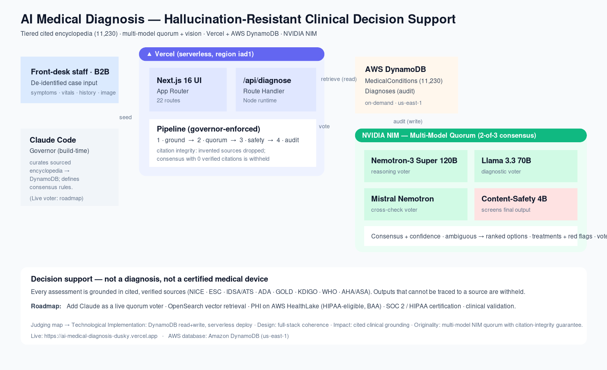

# AI Medical Diagnosis — Hallucination-Resistant Clinical Decision Support

> A B2B clinical decision-support platform that grounds **every** assessment in cited, verified
> sources. Built for the **H0: Hack the Zero Stack** hackathon (Track 2 — Monetizable B2B), on
> **Vercel + Amazon DynamoDB + NVIDIA NIM**.

**🔗 Live demo:** https://ai-medical-diagnosis-dusky.vercel.app
**📄 Submission write-up:** [`docs/SUBMISSION.md`](docs/SUBMISSION.md)
**🏗️ Architecture diagram:** [`docs/architecture-diagram.svg`](docs/architecture-diagram.svg)

---

## What it is

A decision-support tool sold to **medical-industry businesses** (clinics, practices, hospital
networks) — **the client is the provider organisation, not the patient.** It sits *behind the front
desk*: it relieves pressure at the point of initial contact, helps staff triage faster, and lets
them query a comprehensive, source-cited encyclopedia while assessing a patient.

The core idea: large language models hallucinate, and clinicians won't trust a system that invents
things. So this one **can't present anything it can't cite.** A multi-model quorum reasons only over
verified, retrieved conditions, and any output that can't be traced to a stored source is withheld.



## Key capabilities

- **Multi-model quorum** — three independent LLMs from different families (NVIDIA Nemotron-3 Super
  120B, Meta Llama 3.3 70B, Mistral Mixtral 8x7B) on NVIDIA NIM vote independently; a **2-of-3
  consensus** is required; a dedicated content-safety model screens the result; and a
  **citation-integrity rule drops any source a model invents.**
- **Ambiguity → ranked options** — when no single condition dominates, the system presents the
  ranked differential *options* for clinician review rather than guessing or hiding.
- **Treatments & red-flag recommendations** — guideline-derived management for the consensus
  condition, with "escalate immediately if…" safety-netting.
- **Image analysis & visual differential** — an NIM vision model extracts *visible features* from an
  uploaded image (assistive, not a diagnostic imaging read); results show look-alike conditions with
  open-licensed reference images for side-by-side comparison.
- **Staff encyclopedia lookup** — free-text search across **11,000+ verified conditions** by name,
  ICD-10 or symptom, with citations, treatments and reference images.
- **Embeddable, multilingual pre-triage widget** — a patient-facing widget a clinic embeds on its
  own website (`/widget`), returning a safe disposition (urgent / book / self-care). Available in
  **English, Spanish, Chinese and French** (NVIDIA `riva-translate-4b`): patient input is translated
  to English for matching and the guidance is translated back. Never diagnoses a patient.
- **Patient records** — clinic-held patient records with each patient's linked assessment history
  (`/patients`). The AI engine only ever receives a pseudonymous reference, never the identity.
- **Evidence library** — `/research` surfaces real, current literature pulled from **PubMed (NCBI)**
  across the conditions the knowledge base tracks.
- **Teaching depth** — high-yield conditions carry AMBOSS-style pathophysiology, key investigations
  and learning points, so clinicians and students can learn from each entry.
- **Live audit dashboard** — reads the DynamoDB audit trail (assessment count, consensus rate,
  average confidence, recent assessments).

## The encyclopedia (11,339 conditions, tiered & cited)

| Tier | Count | Source |
|------|-------|--------|
| Curated | 109 | Guideline-cited (NICE/ESC/IDSA/ADA/GOLD/KDIGO/WHO/AHA + NICE CKS / NHS / DermNet) — with treatments & red flags |
| Visible / dermatology | 25 | DermNet-cited, with open-licensed reference images |
| Rare diseases | ~10,000 | HPO / OMIM / Orphanet |
| Common NIH topics | ~1,000 | MedlinePlus |

A commonality prior ranks common conditions ahead of rare ones on equal symptom overlap, so everyday
presentations stay fast and accurate.

## How AWS DynamoDB is used

DynamoDB is on the critical path of **every** request:

- **Read (grounding):** `MedicalConditions` holds the verified encyclopedia. Each request retrieves
  the candidates matching the presentation; the quorum may only reason within these and only cite
  their sources. (A deploy-time snapshot keeps cold starts fast; DynamoDB stays the system of record.)
- **Write (audit):** every assessment — consensus, per-model votes, citations, safety verdict — is
  persisted to the `Diagnoses` table and surfaced live on the dashboard.

## Tech stack

- **Frontend & API:** Next.js 16 (App Router), React 19, Tailwind v4 — deployed on **Vercel**
- **Database:** **Amazon DynamoDB** (AWS SDK v3, document client), on-demand, `us-east-1`
- **AI:** NVIDIA NIM (OpenAI-compatible) — 3 quorum models + 1 content-safety model + 1 vision model
- **Build-time governor:** Claude Code curated the sourced encyclopedia and the consensus rules

## Repository structure

```
frontend/            Next.js app (UI, API routes, lib, data scripts)
  app/               pages + /api routes (diagnose, conditions, diagnoses, pre-triage, widget)
  lib/               quorum, vision, symptom index, DynamoDB access, types
  scripts/           DynamoDB setup + encyclopedia importers + snapshot export
  data/              deploy-time encyclopedia snapshot (conditions.json)
docs/                SUBMISSION.md + architecture diagram
backend/             auxiliary data-build scripts
infrastructure/      infra notes
```

## Local development

```bash
cd frontend
npm install

# Environment (.env.local) — never commit secrets:
#   NVIDIA_NIM_API_KEY=...
#   AWS_ACCESS_KEY_ID=...           AWS_SECRET_ACCESS_KEY=...
#   AWS_REGION=us-east-1
#   DDB_CONDITIONS_TABLE=MedicalConditions   DDB_DIAGNOSES_TABLE=Diagnoses

npm run dev            # start the app on :3000

# Data tooling (need AWS creds):
npm run setup-db          # create DynamoDB tables
npm run seed-db           # seed curated conditions
npm run import-common     # + common primary-care conditions
npm run import-extended   # + multi-specialty conditions
npm run import-visual     # + visible conditions with reference images
npm run import-teaching   # + AMBOSS-style depth on high-yield conditions
npm run apply-citations   # correct any known-broken citation URLs (canonical patch)
npm run export-snapshot   # write data/conditions.json bundled into the deploy

npm run check-citations   # audit: ping every hand-authored citation URL
npm run fetch-pubmed      # refresh data/research.json from PubMed (needs NCBI key)
```

Every citation in the curated/visual tiers is link-checked by `check-citations`; the
templated ontology URLs (OMIM/Orphanet/MedlinePlus/DECIPHER) are generated from real IDs.

## Honest scope

This is clinical **decision support — not a diagnosis, and not a certified medical device.** The
compliance posture is *pre-certification*: built to align with HIPAA controls with de-identified
inputs by design, but formal HIPAA/SOC 2/GDPR certification and prospective clinical validation are
on the roadmap, not claimed as complete. The pre-triage widget never diagnoses a patient or gives
prescription advice.

**Roadmap:** Claude as a live quorum voter (Anthropic API) · OpenSearch vector retrieval · PHI on
AWS HealthLake (HIPAA-eligible, under a BAA) · SOC 2 / HIPAA certification · clinical validation.

## License

Proprietary — all rights reserved. © 2026. Not licensed for reuse without permission.
